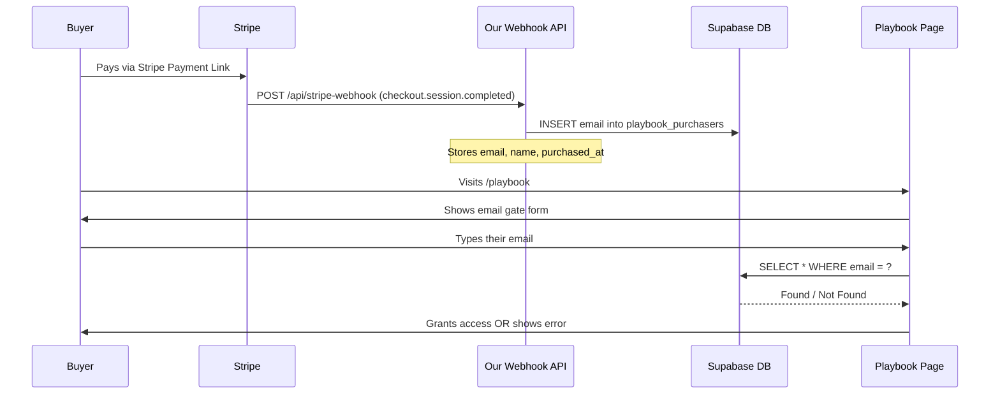

# Playbook Pro — Digital Access System

The core challenge is that Stripe payments are handled externally (via a hosted payment link), so there is no redirect back to our app after checkout. We need Stripe to **push** purchase data to us via a **webhook**, then store the buyer's email in Supabase. The buyer then visits a gated page, types their email, and we check the database to grant access.

---

## How It Works (Flow)



---

## User Review Required

> [!IMPORTANT]
> **Stripe Webhook Secret** — You will need to add `STRIPE_WEBHOOK_SECRET` and `STRIPE_SECRET_KEY` to [.env.local](file:///d:/ReactJS/TALENT-MUCHO-CLIENTS/HAPPY%20VOYAGER/happy-voyager-landing/.env.local). These are found in your Stripe dashboard under **Webhooks** (after registering the endpoint). I'll leave placeholder values — you fill in the real ones.

> [!IMPORTANT]
> **Stripe Payment Link — Collect Email** — Go to your Stripe dashboard → Payment Links → The Solo Voyager link → Edit → make sure **"Collect customer's email"** is turned ON (it usually is by default). This is required so the `checkout.session.completed` event contains the buyer's email.

> [!WARNING]
> **No hard DRM** — This gating is "honor system" security. Anyone who knows a purchaser's email can access it. For a digital doc, this is standard practice (similar to Gumroad, Lemon Squeezy). If you want stronger protection, a magic-link email (sending a one-time login link) can be added later.

---

## Proposed Changes

### 1. Supabase — Database Table

#### [NEW] SQL Migration — `playbook_purchasers` table

Run this in Supabase SQL editor:

```sql
CREATE TABLE playbook_purchasers (
  id UUID DEFAULT gen_random_uuid() PRIMARY KEY,
  email TEXT NOT NULL UNIQUE,
  name TEXT,
  stripe_session_id TEXT UNIQUE,
  purchased_at TIMESTAMPTZ DEFAULT NOW()
);

-- Allow anonymous reads (for email verification from frontend)
ALTER TABLE playbook_purchasers ENABLE ROW LEVEL SECURITY;

CREATE POLICY "Allow email lookup" ON playbook_purchasers
  FOR SELECT USING (true);
```

> [!NOTE]
> The `UNIQUE` constraint on `email` prevents duplicate entries if the webhook fires more than once (Stripe can retry). The `stripe_session_id` also acts as an idempotency key.

---

### 2. Stripe Webhook API Route

#### [NEW] `app/api/stripe-webhook/route.ts`

- Receives `POST` from Stripe
- Verifies the **webhook signature** (using `STRIPE_WEBHOOK_SECRET`) to prevent fake calls
- On `checkout.session.completed` event → extracts `customer_email` and `customer_details.name`
- Inserts into `playbook_purchasers` in Supabase using the **service role key** (bypasses RLS)

**New env vars needed:**
```
STRIPE_SECRET_KEY=sk_live_...
STRIPE_WEBHOOK_SECRET=whsec_...
SUPABASE_SERVICE_ROLE_KEY=eyJ...
```

---

### 3. Stripe Dashboard — Register the Webhook

After deploying (or using `ngrok` for local testing):
- Go to Stripe Dashboard → Developers → Webhooks → Add endpoint
- URL: `https://your-domain.com/api/stripe-webhook`
- Event: `checkout.session.completed`
- Copy the **Signing secret** → paste as `STRIPE_WEBHOOK_SECRET`

---

### 4. Playbook Access Page

#### [NEW] `app/playbook/page.tsx`

A gated page with two states:
1. **Email Gate** — A simple, premium-looking form asking for the buyer's email
2. **Playbook Content** — The actual digital document/guide, rendered inline

The email check is done client-side against Supabase (using the existing `NEXT_PUBLIC_SUPABASE_*` vars with the anon key and the RLS read policy we created).

Session is persisted in `sessionStorage` so they don't have to re-enter their email on every page load.

---

### 5. Playbook Content Structure

#### [NEW] `app/playbook/content.tsx` (or MDX)

The actual Playbook Pro content rendered as a styled React component. This will be a rich, readable document with sections, callouts, links, etc. — styled consistently with the Happy Voyager brand.

---

### 6. Update PricingSection CTA (Solo Voyager)

#### [MODIFY] [components/PricingSection.tsx](file:///d:/ReactJS/TALENT-MUCHO-CLIENTS/HAPPY%20VOYAGER/happy-voyager-landing/components/PricingSection.tsx)

The **"Get the Playbook Pro"** button currently links directly to Stripe. We keep that, but we can optionally add a **"Already purchased? Access here →"** small link below the button that takes them to `/playbook`. This is a nice UX touch.

---

## Verification Plan

### Automated / Semi-automated

| Step | How |
|------|-----|
| Webhook receives and parses correctly | Use **Stripe CLI** locally: `stripe listen --forward-to localhost:3000/api/stripe-webhook` then `stripe trigger checkout.session.completed` |
| Email inserted into Supabase | Check Supabase Table Editor after trigger |
| Email gate accepts valid email | Visit `/playbook`, type the inserted email, confirm access |
| Email gate rejects invalid email | Type a random email, confirm error message shown |
| Duplicate webhook doesn't create duplicate row | Run `stripe trigger` twice — table should still have 1 row (due to UNIQUE constraint) |

### Manual Verification

1. Make a real test purchase using a Stripe test card
2. Check Supabase `playbook_purchasers` table — row should appear within seconds
3. Visit `/playbook` — enter the purchase email — confirm content unlocks
4. Clear session storage, revisit — email gate should re-appear
